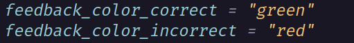

# DTS - Dial Tracking System

The goal of this simulation software is to study users'
reaction time in the presence of distractions. The distraction in
question is a ball located at the center of the window, within a 
designated box, which the user has to control at all times. 
This ball will move at random velocities and times, 
with parameters that can be specified.

The reaction time test involves a set of dials located at the
bottom of the window. These dials will trigger an alarm sound
or other specified sound, prompting the user to press the 
corresponding key attached to the dial. The program will then
track the position of the ball in relation to the center of the
screen, which is represented by a cross, and output test values
such as the Root Mean Square Error (RMSE) in a .csv file.


>The program was made for the use of the human factor's team 
at Embry-Riddle Aeronautical University to help with their
research. However, the program may be used by any audience.


**More description and guides are shown in this document.**


## User Interface System
This section shows how the UI of the program looks like. 


### Tracking Frame 
The main interaction of the program is in the white outlined
box, or Tracking Frame. Within this box there is a cross
marking its center. The green dot represents the ball, 
and it will move freely, unless controlled, throughout 
the tracking frame never going off limits.

### Ball Movement
The Ball on the screen, the little green dot, will move freely
around the Tracking Frame. It will bounce back every time 
it hits the walls. Its direction will change randomly at 
given intervals. This intervals can be customized in the 
[config](#config-setup) file. A user may control the ball 
in 2 ways. One is by using the arrow keys, and the most 
preferred one is the joystick input where the user may 
use a joystick. **BEWARE!!** Not all joysticks have been 
tested, we cannot guarantee that all joysticks can work.


### Dials 
Below the Tracking Frame, dials are setup. One is able to 
configure the numbers of dials that appear in the program
via the [config](#config-setup) file. Each dial represents a trial
where an alarm should go off. The alarm will go off once its dial
has reached the time limit. It is possible to change alarm sounds
based on the dial. Once an alarm goes off, the dial will wait for a key input
and until then, its needle will remain still outside the dial's bound. The key input
can be any key pressed after the alarm goes off, no matter if it's the wrong or right
key. The right key has to be specified in the config file as well or default values
will be used. 


## Config Setup
This section aims to help understand how to properly use 
the config file used in the program. Is important to know
that syntax and typos are important in this config as the 
extension of the file is **toml**. I will not explain 
how toml works, I recommend visiting [toml_template](https://toml.io/en/)
for any questions on why something is the way it is. 

>A config file will be automatically made if no config file 
is found when the program is runned.

Make sure to have your config file with named as such **config_file.toml**


### Input Mode
This is how one specifies the type of input the program should use.
It will **NOT** detect it automatically.

Input Mode should be the first line of the config file, and suggest
leaving it like that to not have any issues. 

If the config file is made by the program, it will then 
choose keyboard as the default input mode. Something 
like this
```toml
input_mode = "keyboard"
```


To change the input mode to joystick it will be very similar
to keyboard. 

```toml
input_mode = "joystick"
```
Input Mode should be only variable that is outside of a section.
What do I mean by section? We will see just now.

### Ball Section
In toml, one is able to specify a section and separate 
variables that will only go into that section. That is 
how the program divides specific information that is important 
to independent components within the program. For example, the ball. 
The program allows for some flexibility in order to change 
some behaviors of how the ball should act.  

To specify the Ball Section the config file must have this. 
```toml
[ball]
```

This is the start of the section, now the variables we put 
after this call correspond to the ball.

The ball only uses 3 variables in total. 2 variables are 
for the time interval for when the ball should change velocities. The last 
variable is to specify the speed. 

#### Time Interval 
```toml
random_direction_change_time_min = 1.0
random_direction_change_time_max = 8.0
```
As specified before, this two variables are the minimum and 
maximum values for the interval of when the ball will change 
its velocity. How it works is that when the program runs, the ball 
may change its velocity any time from, in this example, 1
second and 8 seconds since the last change of velocity. Always
being random at every iteration. 


#### Speed 
```toml
ball_velocity = "slow"
```
The above code shows how to specify the speed of the ball. 
For now the program only supports 3 types of velocity, slow,
medium, and fast. One may not be able to change the values that 
correspond to slow, medium or fast. 

When writing the velocities make sure to always do in lower case. 

```toml
ball_velocity = "medium"
```
```toml
ball_velocity = "fast"
```

##### Example 
This is how a good ball section would look like. 


### Trials Setup
This is where it will get a bit confusing 
for those who may not have experience in toml files. I promise
not to make it worst.

When setting up the trials one has to do a few things. First, 
specify to toml that we want to make a trial. This is similar 
to what we did in the [Ball Setup](#ball-section) section, just
with a little difference. The program is meant to work with 
multiple trials. To save someone to having to write a new 
section every time for a new trial like: 
``` toml
[trial1]
[trial2]
[trial3]
```
The config file writes the multiple trials section names 
in list syntax, or array for my fellow programmers. 
Let me stop and show. 

``` toml 
[[trial]]
[[trial]]
[[trial]]
```
The above code believe it or not does the same as the previous one 
with trial1, 2 and 3. But in this case one does not need to put
the numbers. Now is **IMPORTANT** to know that the order matters. This
matters for understanding the output file after the program runs. 
The first **[[trial]]** represents **trial1**. 

**DO NOTICE** the extra square brackets [].

Now one can just modify every trial a different way. So lets 
go into what variables are needed for every trial. 

Here is what a normal configuration of a single trial 
would look like, I would go into depth on what every variable 
means. 


##### Correct Key 
The **correct_response_key** corresponds to what the name 
suggest, the right key to press for that trial. 
The keys can be any keybind in a keyboard that is either 
a normal or letter. Special characters are not supported.

Another example: 

```toml 
correct_response_key = "F"
```

But not this 
```toml 
correct_response_key = "$"
```

**IMPORTANT** If an invalid correct key is given. The program 
will still keep running, but it will just not allow the 
input of the correct key, only wrongs. 


##### Feedback Output 

The program also has feedback for the user who is running the 
trials. This feedback is to allow the user to know if they 
pressed the correct key. 

There are two types of feedback: text, and frame color. Both
of this can be customized as well. This was done with the 
purpose of playing with the tester's mind to see if they 
should trust the system. 

##### Feedback Text 


Each variable represents their behavior to their respective 
action. For example **feedback_text_correct** will only display
it's text if the correct key is pressed. Or, the other way arround 
if incorrect key is pressed.

As stated before, this two are customizable. The text can be 
anything, and it does not have to be all capitals. 

We recommend to not have the texts too long though. The 
time the texts will be in screen is about 1 second.

##### Feedback Color 



These two variables change the color of the Tracking Frame, in 
other words the white square. Just like the text, the colors 
are customizable but not as free. There are only 3 colors to 
choose from, "red", "green", and "blue". White is not an option 
as it's the default color. 

**DO NOTICE** the colors must be in lower case. 

##### Dial Name 
```toml 
dial = "d6"
```
This corresponds to the dial that will be attached to the 
trial. The name is not important, but what it is important 
is that the name must exist within a dial. To establish a dial's 
name go to [Dial Setup](#dial-setup) section. Just remember 
this two need to match in order to work properly.

##### Alarm settings


The last two variables corresponds to how are alarms setup-ed
for each trial. 

First is which alarm is the trial going to use. We link them 
by names. 
```toml
alarm = "a1"
```

The alarm name can be anything, but it must be an existing 
alarm name, we late show how to set up an alarm. 

```toml
alarm_time = 4.0
```

Corresponds to the time, in seconds, we want the alarm 
in the trial to go off at. This time runs after an alarm 
has gone off. Meaning that other trial's alarms will not 
go off until one is activated. This is except the first trial. 

It is important to keep the same syntax for the time. 
Keep it decimal even if it's a whole number. 


### Dial Setup
We gonna introduce some sort of toml logic. We have introduce 
already how to make some sort of list with sections like 
```toml 
[[trials]]
```
Well there is this thing we can do where can modify the 
list as well within toml. We don't do it for trials as we don't 
necessarily need to. But for this section is different. 

The program supports customized amount of dials, I won't say infinite 
as I don't recommend using too many as it will probably make the dials 
small. The way the program organizes these dials is by rows. A row 
may have multiple dials. I won't into detail exactly how toml makes it 
work. But the gist of it is that one can make multiple rows after 
making the first call. Something like this 

##### Row System
```toml 
[[row]]
```

This will make the list where we will store the dial 
in the first row. It does not have to be called *row* 
specifically, but in order to make sense is better 
if it's called that. Now to add and make a dial into 
this row is by doing this format. 


The image above shows the proper way to setup a dial within 
a row. First notice the very first line of the image. 
```toml 
[[row.dial]]
```
This is the format to use when making a new dial within the row. Be ware 
this just adds one dial to row. If we wanted two dials within row we would 
have to add a second *[[row.dial]]* with the proper setup. 

Now let's break down what the other components are to properly 
setup a dial. 

##### Name and Speed

First let's mention the variables that speak for themselves. The 
**name** variable is to specify the name of the dial we are setting up. 
Make sure this name is the same used when linking a trial to 
this dial. We **HIGHLY RECOMMEND** to use the format of using 
"d" as the name initializer to establish is a dial. Then use a number 
to rank the dial. This is to make it easier for the program 
to parse it. 

The **speed** variable is like the speed of ball. There are only 
3 options for it, **slow**, **medium** , and **fast**. We recommend 
using **slow**, and **medium** to allow for an easier follow of 
the needle in the dial. If what you prefer is dials moving fast so 
is harder to track and **fast** is for you.

**IMPORTANT** 

Make sure that the order of the variables stays the same. Meaning name 
is the first variable called and speed is the last.


##### Dial Range
Dial Range corresponds to the green area of the dial. This range 
goes from 0-10,000. A needle will move in the range area until 
its' corresponding dial's alarm is ready to go off. Once the alarm 
of the dial is ready to go off, the needle will make it's way to 
outside the range. 

```toml 
range_start = 200.0
```
This variable specifies where to start the range from. The start is 
not bounded to be 0.0, it can start from anywhere. Also, keep in mind 
the units of the number. The number you use must be in decimal syntax 
and not just whole number. 

```toml 
range_end = 4200.0
```

This variable specifies where to end the range. Just like the range_start, 
the range_end is not bounded by anything. It can be any value, even the 
same as the start value. Notice though that it needs to be 
the same type of units of decimal. 

##### Making a new row

The above guide helped make a single row of dials. Well just one 
dial at the moment, if we wanted to make more dials we would 
just repeat the steps once again. 

But now lets add a second row. How would we do this? It is
the same way as making a new row. We would call 
```toml
[[row]]
```

Then repeat the steps to make dials within the row. 
Here is an example on how the config file look like for this. 


The image above shows the creation of 2 rows of dials. 
The first call of [[row]] marks the start of the first row, 
and we proceed to make 3 dials within the row. Then we call 
[[row]] once more in order to make the second row, and make
2 dials within the row. 

#### Alarms

Last but not least we will show how to configure the use of alarms. 


Making an alarm is very simple as the image above shows. One 
establishes a name, this is **a1** in this case. Then we specify 
a path to the audio file we want the alarm to display. It is 
important to know that path matters. 

For example, if the audio files are within the same directory/folder 
as the program then the name should be only thing written. 
But in the case that you want to have the alarms within a folder,
then you need to write the whole path to the audio file you are 
trying to use. Something like 

```python
audio_path = "folder/alarm.wav"
```
In this example the program will look into a folder with the name 
"folder" for the alarm.wav

**IMPORTANT** 
Notice that to start an alarm we use the syntax **[[alarms]]**. This 
allows for the creation of multiple alarms. Just how we did with 
rows.


## Final Words
If at any time there are some issues within the program 
please be sure to make a Github Issues and one of the authors 
should respond at their earliest convenience. 

Keep in mind this program was done with the purpose of research 
and not as a game or typical software to use. So we as the 
authors won't be working on this software no more unless if 
it's with the purpose of making research much easier to make, and 
it comes directly from the University Human Factor's department.


## Authors
[@Luke Newcomb](https://github.com/newcomb-luke)

[@Walter Hernandez](https://github.com/HernanW4)

[@Troy Neubauer](https://github.com/TroyNeubauer)


